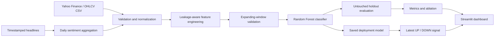

# SmartSignal

SmartSignal is an end-to-end research pipeline for predicting whether a stock's
next closing price will move up or down. It combines technical indicators,
volume behavior, and daily news sentiment in a leakage-aware Random Forest
workflow.

The repository includes data ingestion, feature engineering, chronological
validation, model persistence, a command-line interface, automated tests, CI,
and an interactive dashboard.

> Research and education only. This project is not investment advice.

## Benchmark

The demo uses a deterministic market-like dataset so the full pipeline can run
without an API key or network connection.

| Evaluation | Random Forest | Persistence baseline | Lift |
| --- | ---: | ---: | ---: |
| Final chronological holdout | **66.9%** | 50.3% | **+16.6 pp** |
| Five-fold walk-forward validation | **63.3%** | - | - |
| Holdout ROC AUC | **0.687** | 0.500 | - |

Sentiment ablation on the same untouched holdout:

| Feature set | Accuracy |
| --- | ---: |
| Technical indicators only | 60.7% |
| Technical indicators + sentiment | **66.9%** |

These results are from generated market-like data and do not represent
guaranteed performance on live securities. Live ticker runs produce their own
metrics and may underperform the baseline.

## Features

- Automated OHLCV ingestion from Yahoo Finance or local CSV files
- Twenty-six momentum, trend, volatility, volume, calendar, and sentiment features
- A transparent finance-headline sentiment prototype with negation handling
- Expanding-window validation and a final untouched chronological holdout
- Random Forest evaluation against a persistence baseline
- Accuracy, precision, recall, F1, ROC AUC, Brier score, and confusion matrix
- Sentiment ablation, feature importance, and illustrative strategy diagnostics
- Saved model, prediction history, metrics, and latest next-day signal
- Streamlit and Plotly dashboard for communicating results
- Unit tests, linting, packaging, and GitHub Actions CI

## Architecture



The target for row `t` is whether `close[t + 1] > close[t]`. Every predictor in
row `t` uses only information available at or before the close of day `t`.
Rows are never randomly shuffled.

## Quick Start

Python 3.11 or newer is required.

```powershell
python -m venv .venv
.\.venv\Scripts\Activate.ps1
python -m pip install -e ".[app,dev]"
smartsignal demo
streamlit run app.py
```

Running the dashboard directly generates the demo on first launch when no
artifacts are present.

The demo writes these files to `artifacts/`:

- `metrics.json`: full evaluation record and methodology
- `predictions.csv`: dated out-of-sample probabilities and returns
- `feature_importance.csv`: ranked Random Forest feature importance
- `latest_signal.json`: most recent direction and confidence
- `model.joblib`: deployment model trained on all labeled observations

## Run on Market Data

Download adjusted daily history and evaluate a ticker:

```powershell
smartsignal fetch --ticker MSFT --start 2018-01-01
```

Train from a local file with `date, open, high, low, close, volume` columns:

```powershell
smartsignal train --csv data/my_stock.csv --ticker CUSTOM
```

Score timestamped headlines and join them into training:

```powershell
smartsignal score-headlines `
  --csv data/sample_headlines.csv `
  --output data/daily_sentiment.csv

smartsignal train `
  --csv data/my_stock.csv `
  --ticker CUSTOM `
  --sentiment-csv data/daily_sentiment.csv
```

## Evaluation Design

1. Build indicators from historical prices, volume, and optional sentiment.
2. Reserve the newest 20% of observations as a final holdout.
3. Run five expanding-window validation folds inside the older 80%.
4. Fit the selected Random Forest on the pre-holdout observations.
5. Compare holdout predictions with a naive persistence baseline.
6. Refit a deployment model on all labeled rows and score the latest day.

The illustrative long/short diagnostics omit fees, spread, slippage, taxes, and
position constraints. They are included to demonstrate evaluation plumbing,
not to claim a tradable strategy.

## Development

```powershell
pytest
ruff check src tests app.py
```

The test suite covers deterministic data generation, schema normalization,
target alignment, look-ahead protection, sentiment scoring, model artifacts,
and latest-signal generation.

## Limitations

- Directional predictability changes across securities and market regimes.
- Feature importance is descriptive and does not establish causality.
- The lexicon scorer is intentionally lightweight; a future version could use
  FinBERT with timestamped news and source-quality controls.
- Hyperparameters are fixed for consistent demo results. Production model
  selection should use nested time-series validation.
